# Workflows

The GitHub Actions workflows of this repository, and how they connect.
The diagrams are generated from the workflow files by
[workflow-graphs](https://github.com/FlorianSchw/package-workflows) and
updated when the workflows change. Text outside the marked diagram
blocks is yours: add explanations anywhere, it is never overwritten.

## Overview

<!-- workflow-graphs:overview:start -->
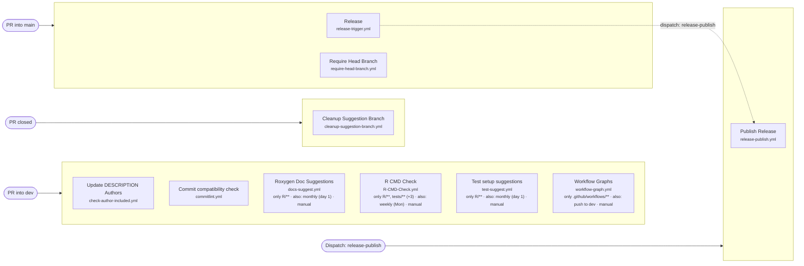
<!-- workflow-graphs:overview:end -->

## Workflows

<!-- workflow-graphs:detail:check-author-included.yml:start -->
### Update DESCRIPTION Authors

`check-author-included.yml`

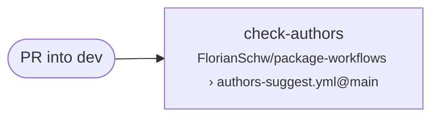
<!-- workflow-graphs:detail:check-author-included.yml:end -->

<!-- workflow-graphs:detail:cleanup-suggestion-branch.yml:start -->
### Cleanup Suggestion Branch

`cleanup-suggestion-branch.yml`

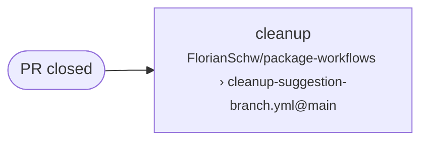
<!-- workflow-graphs:detail:cleanup-suggestion-branch.yml:end -->

<!-- workflow-graphs:detail:commitlint.yml:start -->
### Commit compatibility check

`commitlint.yml`

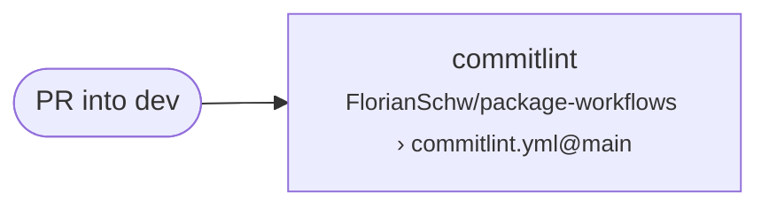
<!-- workflow-graphs:detail:commitlint.yml:end -->

<!-- workflow-graphs:detail:docs-suggest.yml:start -->
### Roxygen Doc Suggestions

`docs-suggest.yml`

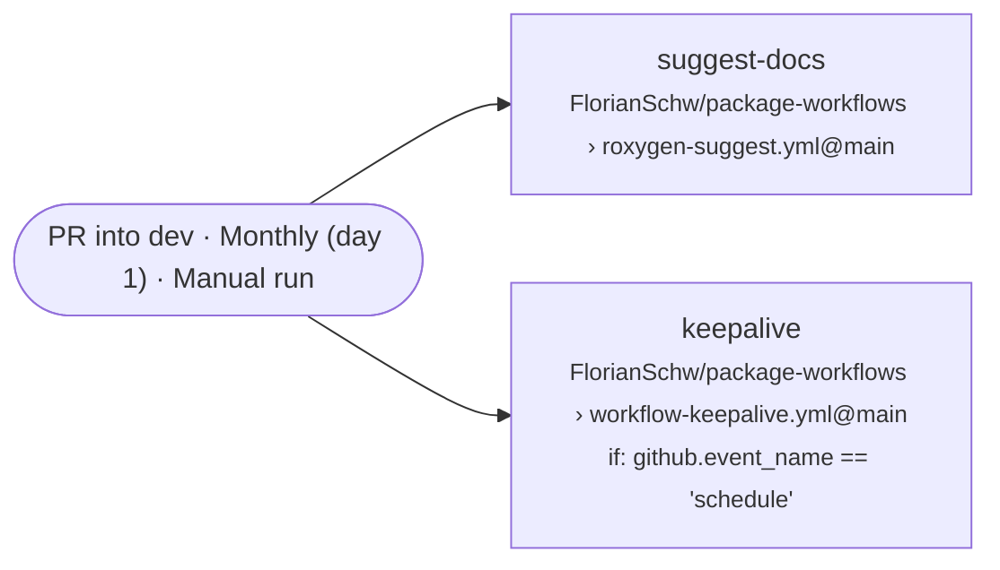
<!-- workflow-graphs:detail:docs-suggest.yml:end -->

<!-- workflow-graphs:detail:R-CMD-Check.yml:start -->
### R CMD Check

`R-CMD-Check.yml`

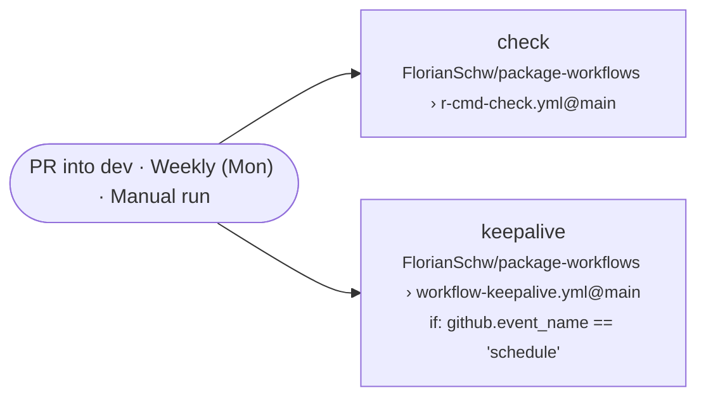
<!-- workflow-graphs:detail:R-CMD-Check.yml:end -->

<!-- workflow-graphs:detail:release-publish.yml:start -->
### Publish Release

`release-publish.yml`

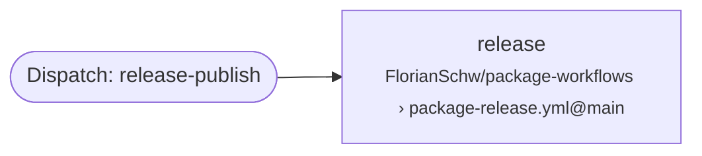
<!-- workflow-graphs:detail:release-publish.yml:end -->

<!-- workflow-graphs:detail:release-trigger.yml:start -->
### Release

`release-trigger.yml`

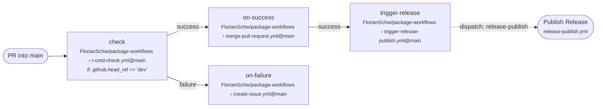
<!-- workflow-graphs:detail:release-trigger.yml:end -->

<!-- workflow-graphs:detail:require-head-branch.yml:start -->
### Require Head Branch

`require-head-branch.yml`

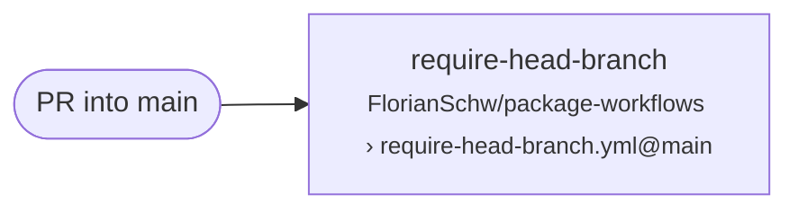
<!-- workflow-graphs:detail:require-head-branch.yml:end -->

<!-- workflow-graphs:detail:test-suggest.yml:start -->
### Test setup suggestions

`test-suggest.yml`

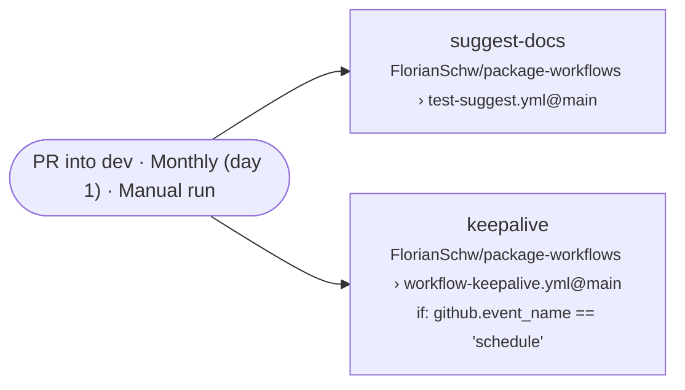
<!-- workflow-graphs:detail:test-suggest.yml:end -->

<!-- workflow-graphs:detail:workflow-graph.yml:start -->
### Workflow Graphs

`workflow-graph.yml`

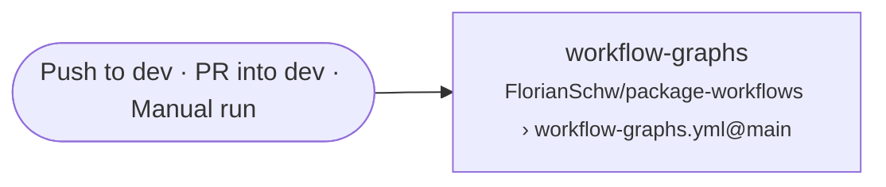
<!-- workflow-graphs:detail:workflow-graph.yml:end -->
