# Workflows

The GitHub Actions workflows of this repository, and how they connect.
The diagrams are generated from the workflow files by
[workflow-graphs](https://github.com/FlorianSchw/package-workflows) and
updated when the workflows change. Text outside the marked diagram
blocks is yours: add explanations anywhere, it is never overwritten.

## Overview

<!-- workflow-graphs:overview:start -->
| Name | File | Runs on | Calls | Produces |
|---|---|---|---|---|
| Update DESCRIPTION Authors | `check-author-included.yml` | PR into dev | FlorianSchw/package-workflows › authors-suggest.yml@main | Suggestion PR Comment on the PR |
| Commit compatibility check | `commitlint.yml` | PR into dev | FlorianSchw/package-workflows › commitlint.yml@main | Check: commit messages follow Conventional Commits |
| Roxygen Doc Suggestions | `docs-suggest.yml` | PR into dev (only R/\*\*) · Monthly (day 1) · Manual run | FlorianSchw/package-workflows › roxygen-suggest.yml@main FlorianSchw/package-workflows › workflow-keepalive.yml@main | Suggestion PR — *skipped for PRs from bot-suggest/ branches* Comment on the PR — *skipped for PRs from bot-suggest/ branches* Scheduled workflows kept enabled — *only on schedule* |
| R CMD Check | `R-CMD-Check.yml` | PR into dev (only R/\*\*, tests/\*\*, .github/\*\*, DESCRIPTION, NAMESPACE) · Weekly (Mon) · Manual run | FlorianSchw/package-workflows › r-cmd-check.yml@main FlorianSchw/package-workflows › workflow-keepalive.yml@main | Check: R CMD check passes Scheduled workflows kept enabled — *only on schedule* |
| Test setup suggestions | `test-suggest.yml` | PR into dev (only R/\*\*) · Monthly (day 1) · Manual run | FlorianSchw/package-workflows › test-suggest.yml@main FlorianSchw/package-workflows › workflow-keepalive.yml@main | Suggestion PR — *skipped for PRs from bot-suggest/ branches* Comment on the PR — *skipped for PRs from bot-suggest/ branches* Issue for a likely bug in the code — *skipped for PRs from bot-suggest/ branches* Scheduled workflows kept enabled — *only on schedule* |
| Workflow Graphs | `workflow-graph.yml` | PR into dev (only .github/workflows/\*\*) · Push to dev (only .github/workflows/\*\*) · Manual run | FlorianSchw/package-workflows › workflow-graphs.yml@main | Commit on the branch Comment on the PR |
| Cleanup Suggestion Branch | `cleanup-suggestion-branch.yml` | PR closed | FlorianSchw/package-workflows › cleanup-suggestion-branch.yml@main | Bot branch deleted — *only for PRs from bot-suggest/ branches* |
| Release | `release-trigger.yml` | PR into main | FlorianSchw/package-workflows › r-cmd-check.yml@main FlorianSchw/package-workflows › merge-pull-request.yml@main FlorianSchw/package-workflows › create-issue.yml@main FlorianSchw/package-workflows › trigger-release-publish.yml@main | Check: R CMD check passes — *only if the PR comes from dev* PR merged — *if check succeeds* Issue for the PR author — *if check fails* starts **Publish Release** |
| Publish Release | `release-publish.yml` | Dispatch: release-publish | FlorianSchw/package-workflows › package-release.yml@main | Version commit, tag and draft release |
| Require Head Branch | `require-head-branch.yml` | PR into main | FlorianSchw/package-workflows › require-head-branch.yml@main | Check: PR comes from dev |

### PR into dev

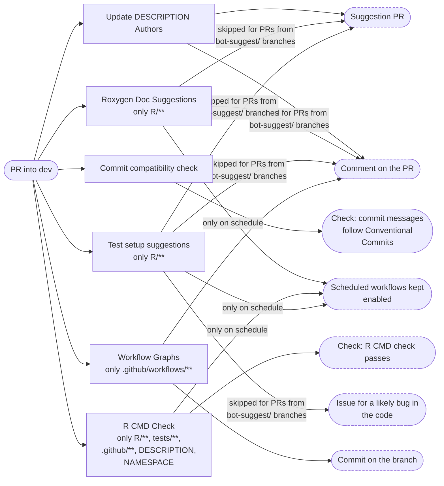

### PR closed

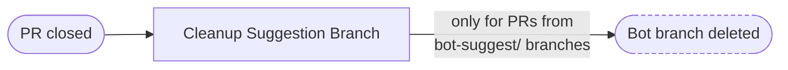

### PR into main

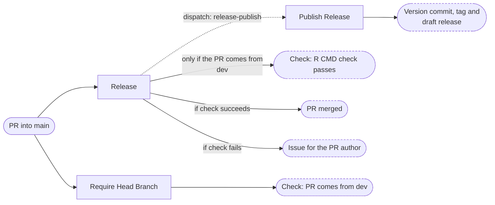

### Push to dev

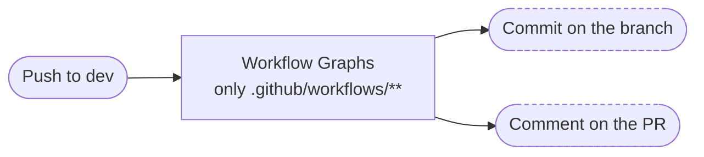

### On a schedule

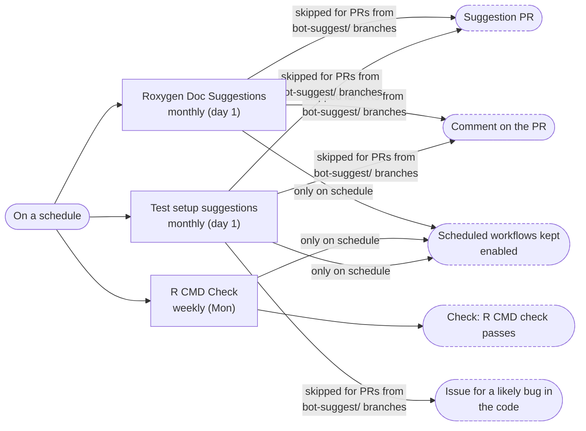
<!-- workflow-graphs:overview:end -->

## Workflows

<!-- workflow-graphs:detail:check-author-included.yml:start -->
### Update DESCRIPTION Authors

`check-author-included.yml`

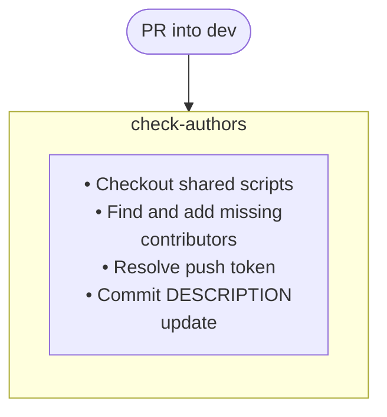
<!-- workflow-graphs:detail:check-author-included.yml:end -->

<!-- workflow-graphs:detail:commitlint.yml:start -->
### Commit compatibility check

`commitlint.yml`

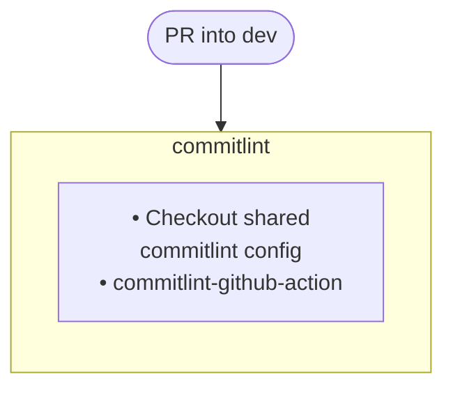
<!-- workflow-graphs:detail:commitlint.yml:end -->

<!-- workflow-graphs:detail:docs-suggest.yml:start -->
### Roxygen Doc Suggestions

`docs-suggest.yml`

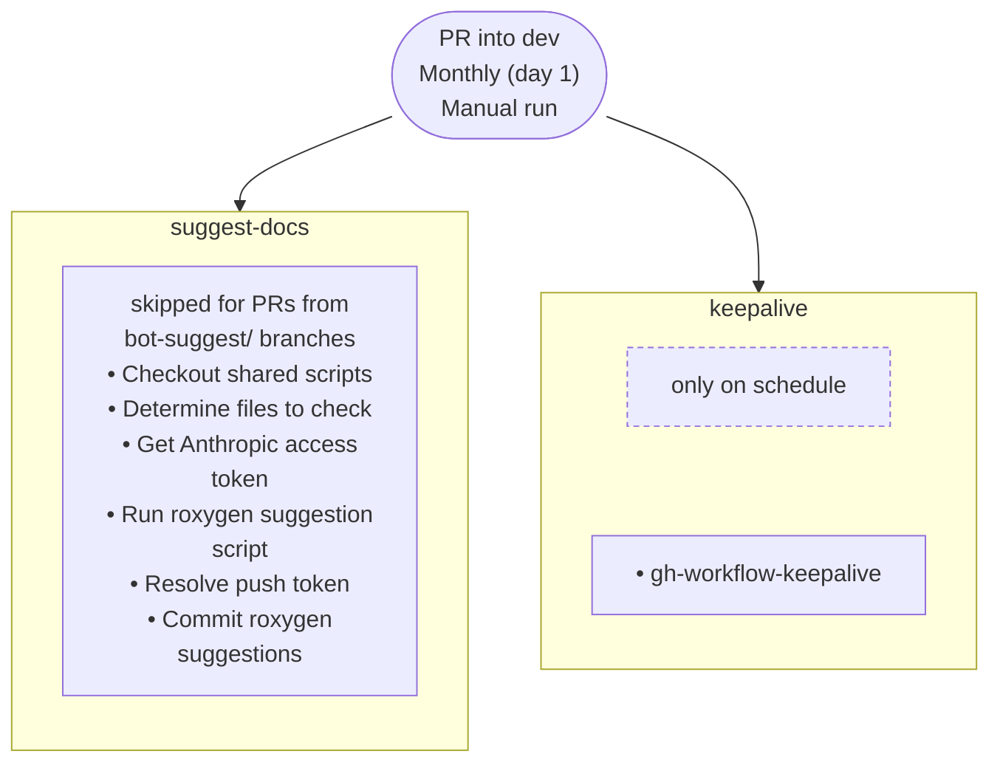
<!-- workflow-graphs:detail:docs-suggest.yml:end -->

<!-- workflow-graphs:detail:R-CMD-Check.yml:start -->
### R CMD Check

`R-CMD-Check.yml`

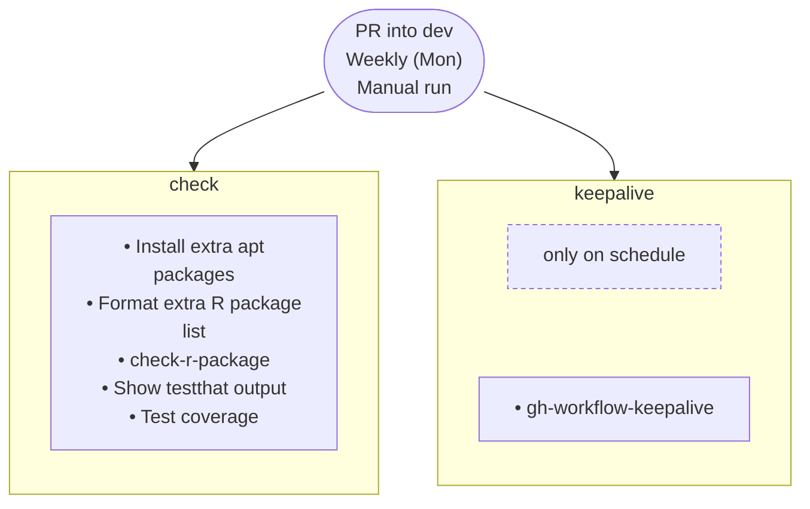
<!-- workflow-graphs:detail:R-CMD-Check.yml:end -->

<!-- workflow-graphs:detail:test-suggest.yml:start -->
### Test setup suggestions

`test-suggest.yml`

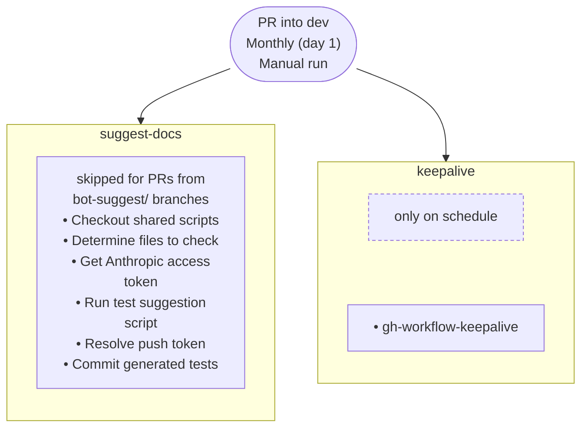
<!-- workflow-graphs:detail:test-suggest.yml:end -->

<!-- workflow-graphs:detail:workflow-graph.yml:start -->
### Workflow Graphs

`workflow-graph.yml`

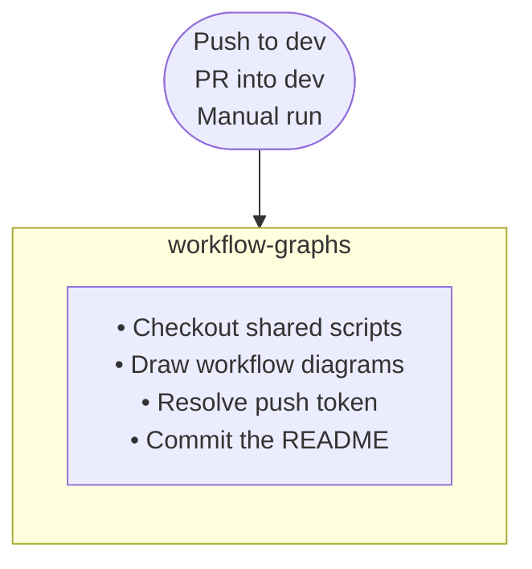
<!-- workflow-graphs:detail:workflow-graph.yml:end -->
<!-- workflow-graphs:detail:cleanup-suggestion-branch.yml:start -->
### Cleanup Suggestion Branch

`cleanup-suggestion-branch.yml`

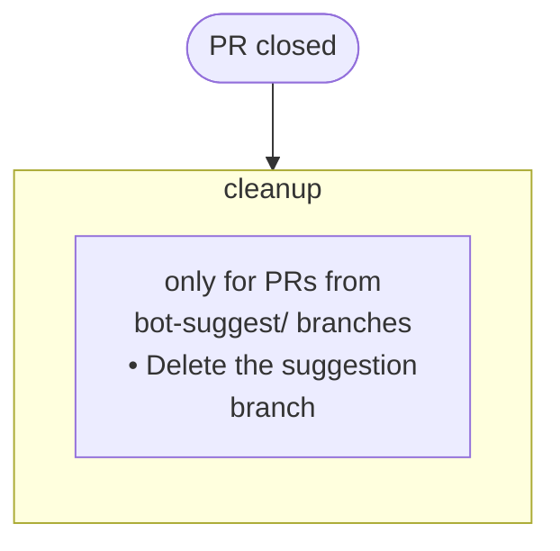
<!-- workflow-graphs:detail:cleanup-suggestion-branch.yml:end -->

<!-- workflow-graphs:detail:release-trigger.yml:start -->
### Release

`release-trigger.yml`

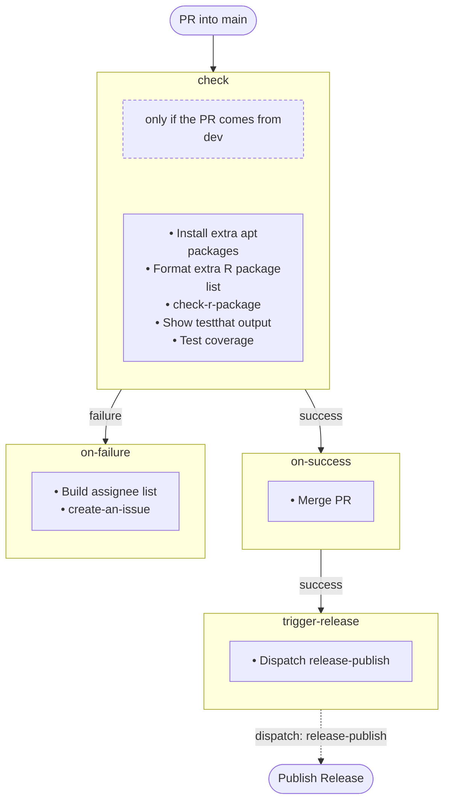
<!-- workflow-graphs:detail:release-trigger.yml:end -->

<!-- workflow-graphs:detail:release-publish.yml:start -->
### Publish Release

`release-publish.yml`

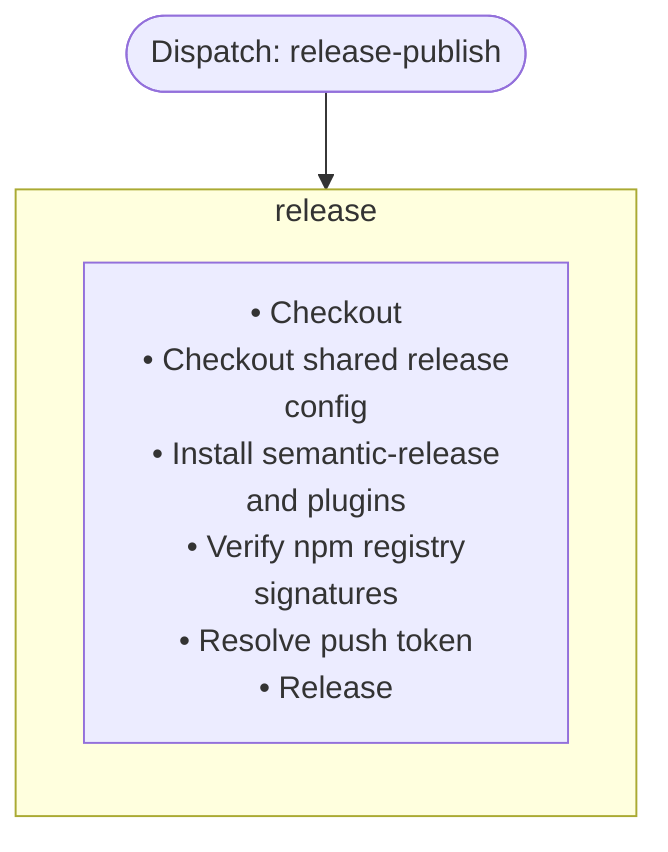
<!-- workflow-graphs:detail:release-publish.yml:end -->

<!-- workflow-graphs:detail:require-head-branch.yml:start -->
### Require Head Branch

`require-head-branch.yml`

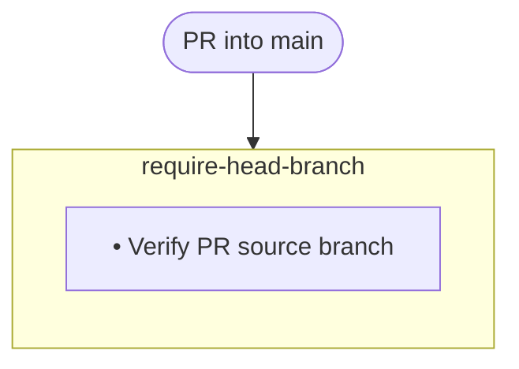
<!-- workflow-graphs:detail:require-head-branch.yml:end -->

