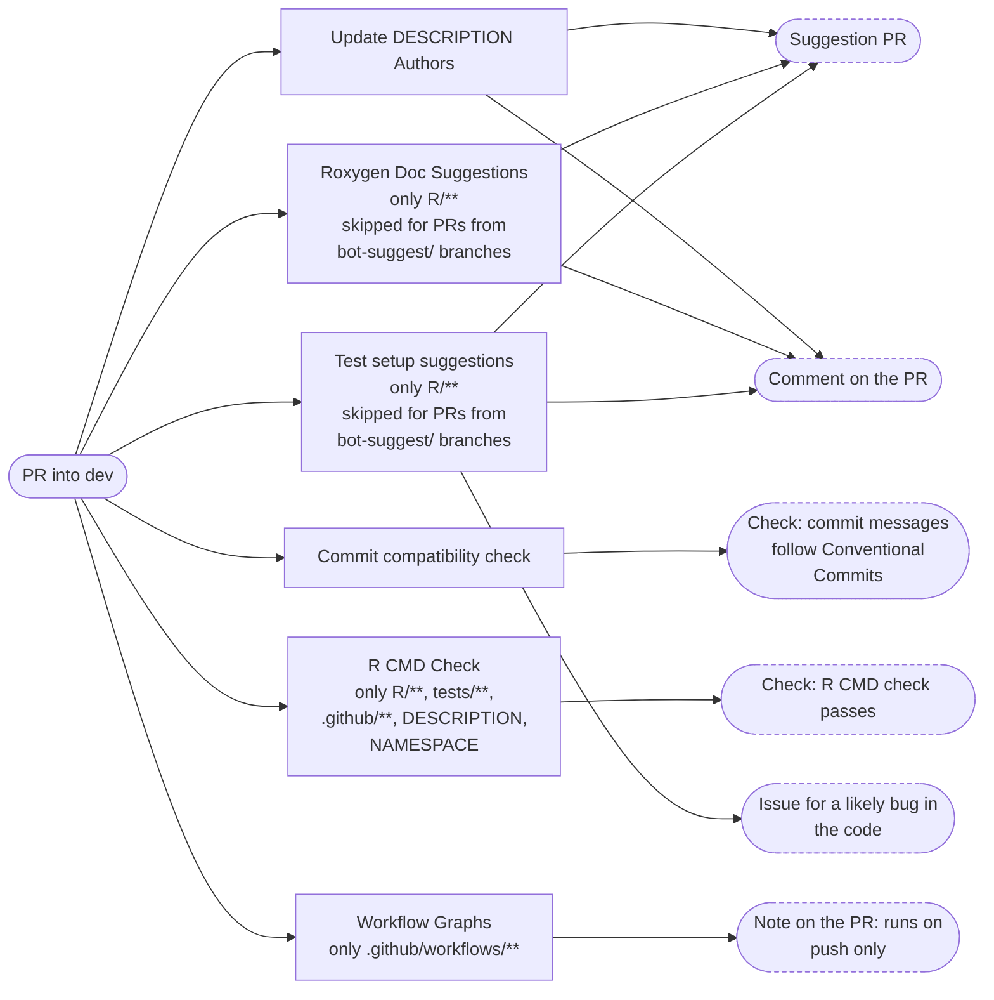
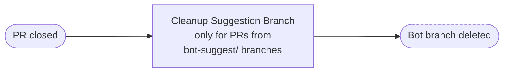
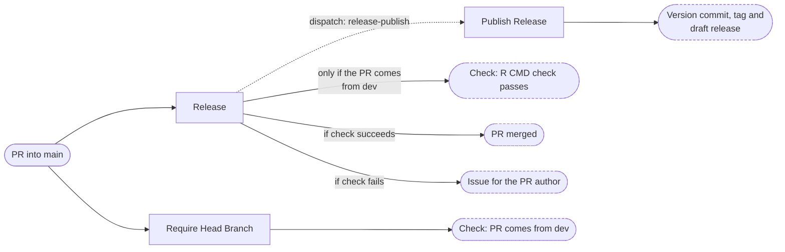
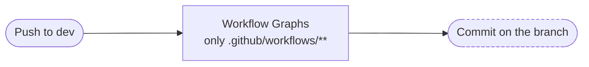
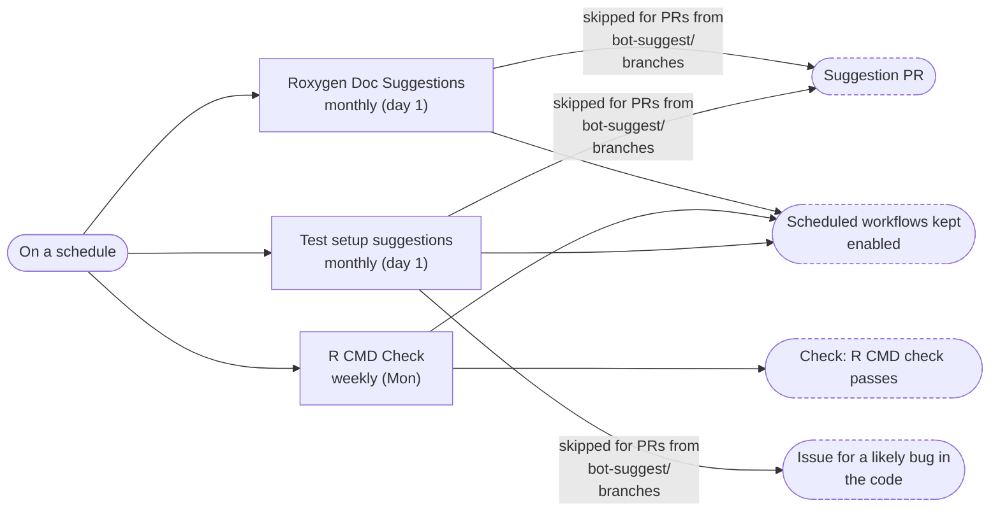

# Workflows

The GitHub Actions workflows of this repository, and how they connect.
The diagrams are generated from the workflow files by
[workflow-graphs](https://github.com/FlorianSchw/package-workflows) and
updated when the workflows change. Text outside the marked diagram
blocks is yours: add explanations anywhere, it is never overwritten.

## Overview

<!-- workflow-graphs:overview:start -->
### All workflows

| Name | File | Runs on | Calls | Produces |
|---|---|---|---|---|
| Update DESCRIPTION Authors | `check-author-included.yml` | PR into dev | FlorianSchw/package-workflows › authors-suggest.yml@main | • Suggestion PR • Comment on the PR — *only on pull request* |
| Commit compatibility check | `commitlint.yml` | PR into dev | FlorianSchw/package-workflows › commitlint.yml@main | Check: commit messages follow Conventional Commits |
| Roxygen Doc Suggestions | `docs-suggest.yml` | • PR into dev (only R/\*\*) • Monthly (day 1) • Manual run | • FlorianSchw/package-workflows › roxygen-suggest.yml@main • FlorianSchw/package-workflows › workflow-keepalive.yml@main | • Suggestion PR — *skipped for PRs from bot-suggest/ branches* • Comment on the PR — *only on pull request, skipped for PRs from bot-suggest/ branches* • Scheduled workflows kept enabled — *only on schedule* |
| R CMD Check | `R-CMD-Check.yml` | • PR into dev (only R/\*\*, tests/\*\*, .github/\*\*, DESCRIPTION, NAMESPACE) • Weekly (Mon) • Manual run | • FlorianSchw/package-workflows › r-cmd-check.yml@main • FlorianSchw/package-workflows › workflow-keepalive.yml@main | • Check: R CMD check passes • Scheduled workflows kept enabled — *only on schedule* |
| Test setup suggestions | `test-suggest.yml` | • PR into dev (only R/\*\*) • Monthly (day 1) • Manual run | • FlorianSchw/package-workflows › test-suggest.yml@main • FlorianSchw/package-workflows › workflow-keepalive.yml@main | • Suggestion PR — *skipped for PRs from bot-suggest/ branches* • Comment on the PR — *only on pull request, skipped for PRs from bot-suggest/ branches* • Issue for a likely bug in the code — *skipped for PRs from bot-suggest/ branches* • Scheduled workflows kept enabled — *only on schedule* |
| Workflow Graphs | `workflow-graph.yml` | • PR into dev (only .github/workflows/\*\*) • Push to dev (only .github/workflows/\*\*) • Manual run | FlorianSchw/package-workflows › workflow-graphs.yml@main | • Commit on the branch — *only on push* • Note on the PR: runs on push only — *only on pull request* |
| Cleanup Suggestion Branch | `cleanup-suggestion-branch.yml` | PR closed | FlorianSchw/package-workflows › cleanup-suggestion-branch.yml@main | Bot branch deleted — *only for PRs from bot-suggest/ branches* |
| Release | `release-trigger.yml` | PR into main | • FlorianSchw/package-workflows › r-cmd-check.yml@main • FlorianSchw/package-workflows › merge-pull-request.yml@main • FlorianSchw/package-workflows › create-issue.yml@main • FlorianSchw/package-workflows › trigger-release-publish.yml@main | • Check: R CMD check passes — *only if the PR comes from dev* • PR merged — *if check succeeds* • Issue for the PR author — *if check fails* • starts **Publish Release** |
| Publish Release | `release-publish.yml` | Dispatch: release-publish | FlorianSchw/package-workflows › package-release.yml@main | Version commit, tag and draft release |
| Require Head Branch | `require-head-branch.yml` | PR into main | FlorianSchw/package-workflows › require-head-branch.yml@main | Check: PR comes from dev |

### What runs when

What each event starts: the workflows, the workflows those start in turn (dotted arrows), and what comes out of it — with the condition on the arrow where there is one.

#### When a pull request into dev is opened or updated

#### When a pull request is closed

#### When a pull request into main is opened or updated

#### On a push to dev

#### On a schedule

<!-- workflow-graphs:overview:end -->

## Workflows

